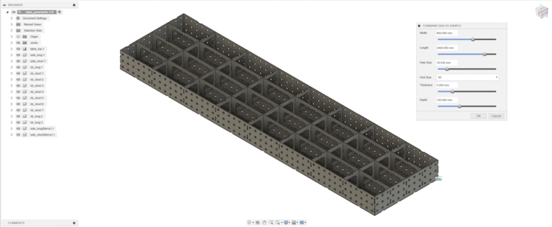
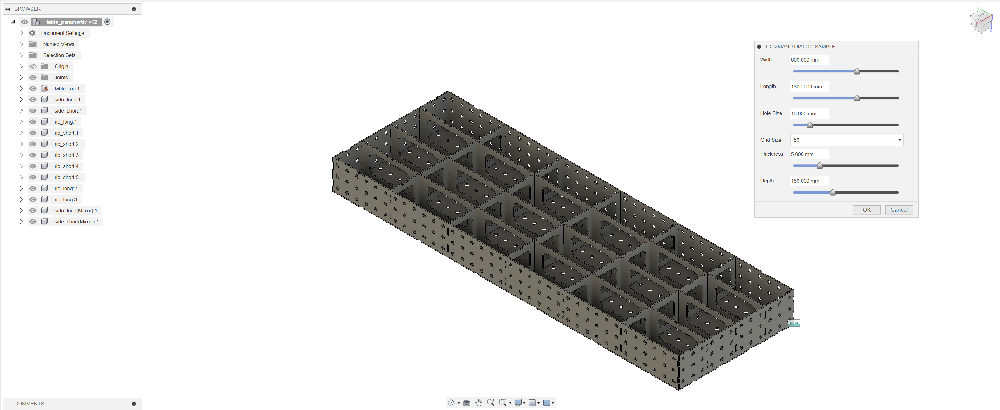
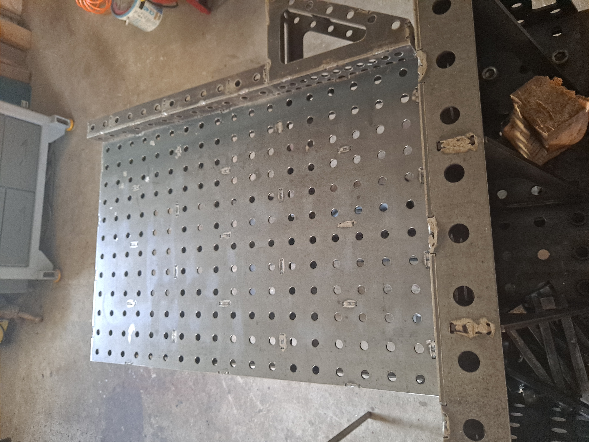
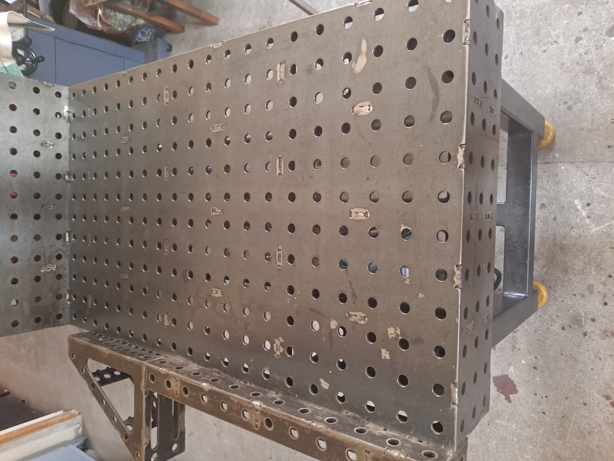

# Fusion 360 API Welding Table Project

This is a Fusion 360 add-in that creates a command with a dialog for setting various parameters. The command allows users to interact with sliders, dropdowns, and checkboxes to configure settings for a design.

## Description
This project helps you design a custom welding table using Fusion 360 and Python. The table is parametric, meaning you can easily 
change its size and shape by modifying the script to fit your needs. The script leverages the Fusion 360 API to automate 
the design process, saving you time and effort. Additionally, the generated table design can be adapted for laser cutting 
from sheet metal, making it convenient for precise manufacturing and ensuring robust construction.

## Features

- **Custom Command**: Adds a custom command to the Fusion 360 interface.
- **Parameter Configuration**: Users can set parameters such as width, length, hole size, grid size, thickness, and depth using sliders, dropdowns, and checkboxes.
- **Rib Distance Calculation**: Automatically calculates and sets the horizontal and vertical rib distances based on user inputs.

## Installation

1. **Clone or Download the Repository**: Download the repository to your local machine.
2. **Locate the Add-in Directory**:
    - On Windows: `C:\Users\<username>\AppData\Roaming\Autodesk\Autodesk Fusion 360\API\AddIns`
    - On Mac: `~/Library/Application Support/Autodesk/Autodesk Fusion 360/API/AddIns`
3. **Copy the Add-in**: Copy the downloaded add-in folder to the AddIns directory.
4. **Restart Fusion 360**: Restart Autodesk Fusion 360 to load the new add-in.

## Usage

1. **Start the Add-in**:
    - Open Fusion 360.
    - Go to the `Scripts and Add-Ins` menu.
    - Find the add-in named `Command Dialog Sample` and click `Run`.
2. **Using the Command**:
    - The command will be available in the `Solid` workspace under the `SolidScriptsAddinsPanel`.
    - Click on the command to open the dialog and configure your parameters.
    - The dialog includes sliders for width, length, hole size, thickness, and depth, as well as a dropdown for grid size.

### Prerequisites

- Autodesk Fusion 360
- Python

##
## License

This project is licensed under the MIT License. See the [LICENSE](LICENSE) file for details.

### Graphics

